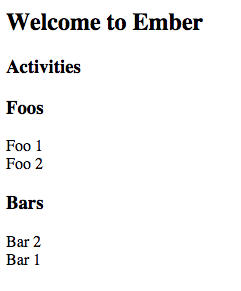

# Ember-data-type-issue

This repo demos an issue with mber Data 2.

See in a [fiddle](http://jsfiddle.net/amk221/aocdzyct/).

#### Description

3 Models:

* Activity
	* name: string
	* type: string
* Foo
	* name: string
* Bar
	* name: string
	

If an Activity model's `type` attribute happens to be the name of an existing model (e.g. 'foo') no activities will be found.

##### Notes

* I've not specified any polymorphism
* This worked before Ember Data 2 (i.e. 2.0.0-beta.2)
* Mocked data is in [app/index.html](app/index.html)

 

